# Process Flow Documentation
## NABKISAN Collection Management System

**Document Version:** 1.0  
**Date:** November 17, 2024  
**Purpose:** Detailed process flows for system implementation

---

## Table of Contents
1. [Core Collection Process Flows](#1-core-collection-process-flows)
2. [Case Management Workflows](#2-case-management-workflows)
3. [Communication Workflows](#3-communication-workflows)
4. [Payment Processing Flows](#4-payment-processing-flows)
5. [Field Collection Processes](#5-field-collection-processes)
6. [Escalation and Strategy Workflows](#6-escalation-workflows)
7. [Reporting and Analytics Flows](#7-reporting-analytics-flows)
8. [Integration Process Flows](#8-integration-flows)

---

## 1. Core Collection Process Flows

### 1.1 End-to-End Collection Process

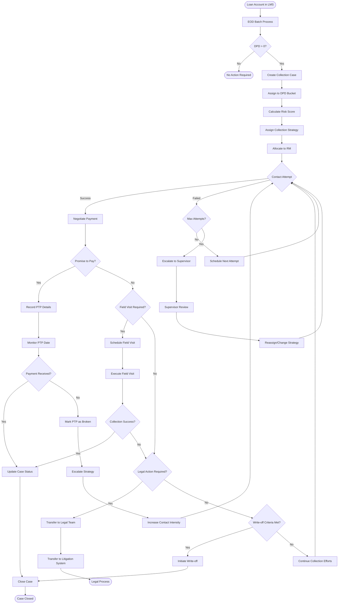

### 1.2 Daily Collection Cycle

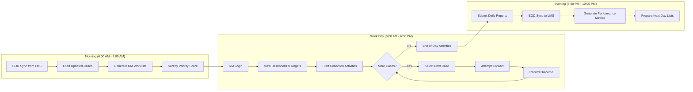

---

## 2. Case Management Workflows

### 2.1 Case Creation and Allocation

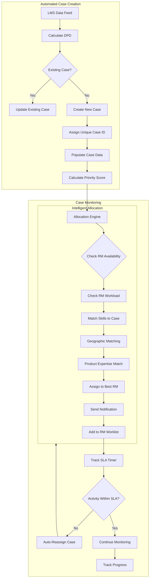

### 2.2 Case Status Management

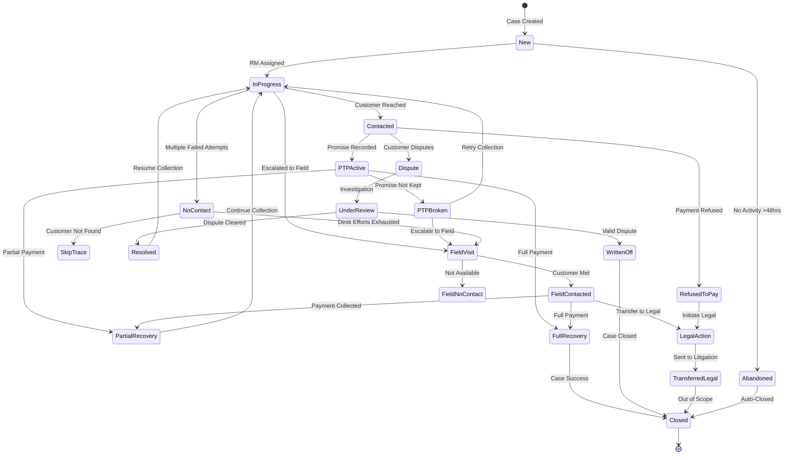

### 2.3 Promise to Pay (PTP) Workflow

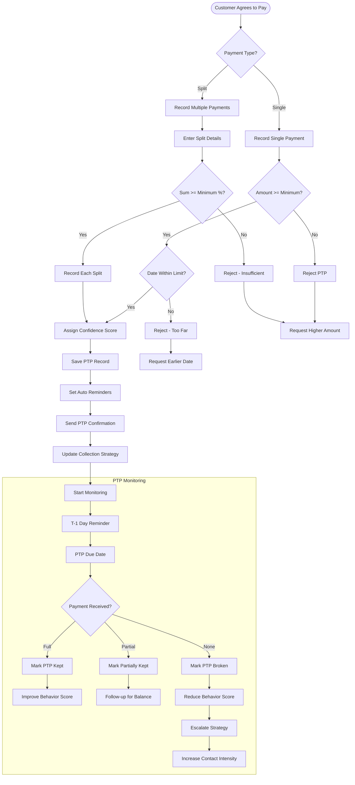

---

## 3. Communication Workflows

### 3.1 Omnichannel Communication Flow

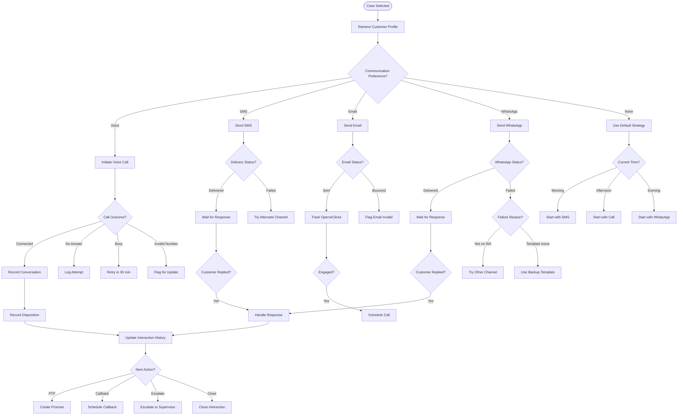

### 3.2 Automated Communication Campaign

```mermaid
flowchart LR
    subgraph Day0_5["DPD 0-5: Soft Reminder"]
        D1[Day 1: SMS Reminder]
        D3[Day 3: WhatsApp with Payment Link]
        D5[Day 5: Email Statement]
    end
    
    subgraph Day6_15["DPD 6-15: Increased Frequency"]
        D7[Day 7: First Call Attempt]
        D10[Day 10: Voice AI Call]
        D12[Day 12: Multiple Channel Outreach]
        D15[Day 15: Supervisor Call]
    end
    
    subgraph Day16_30["DPD 16-30: Intensive Follow-up"]
        D16[Daily Call Attempts]
        D20[Day 20: Formal Notice Email]
        D25[Day 25: Field Visit Warning]
        D30[Day 30: Final Desk Attempt]
    end
    
    subgraph Day31_60["DPD 31-60: Field Integration"]
        D31[Field Visit Scheduled]
        D35[Legal Notice Preparation]
        D45[Day 45: Demand Letter]
        D60[Day 60: Pre-Legal Warning]
    end
    
    subgraph Day61Plus["DPD 61+: Legal Track"]
        D61[Legal Team Handover]
        D75[Arbitration Notice]
        D90[Day 90: NPA Classification]
    end
    
    D1 --> D3
    D3 --> D5
    D5 --> D7
    D7 --> D10
    D10 --> D12
    D12 --> D15
    D15 --> D16
    D16 --> D20
    D20 --> D25
    D25 --> D30
    D30 --> D31
    D31 --> D35
    D35 --> D45
    D45 --> D60
    D60 --> D61
    D61 --> D75
    D75 --> D90
```

---

## 4. Payment Processing Flows

### 4.1 Payment Collection and Processing

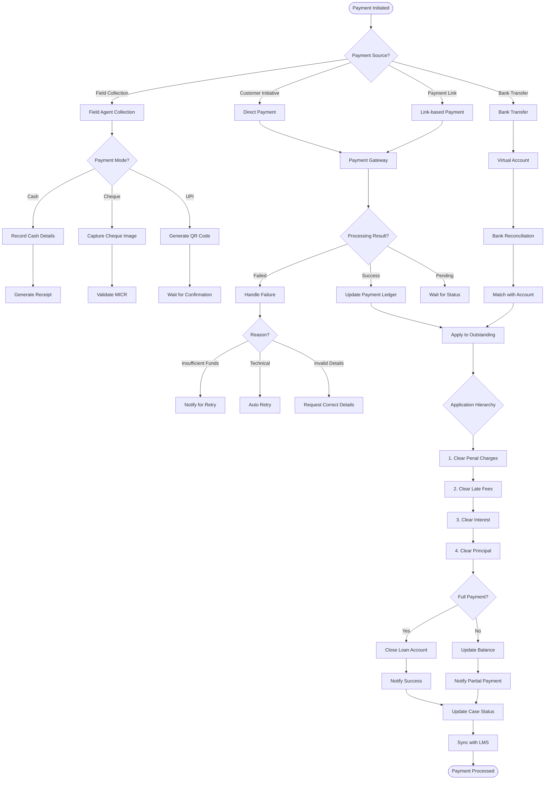

### 4.2 Payment Reconciliation Flow

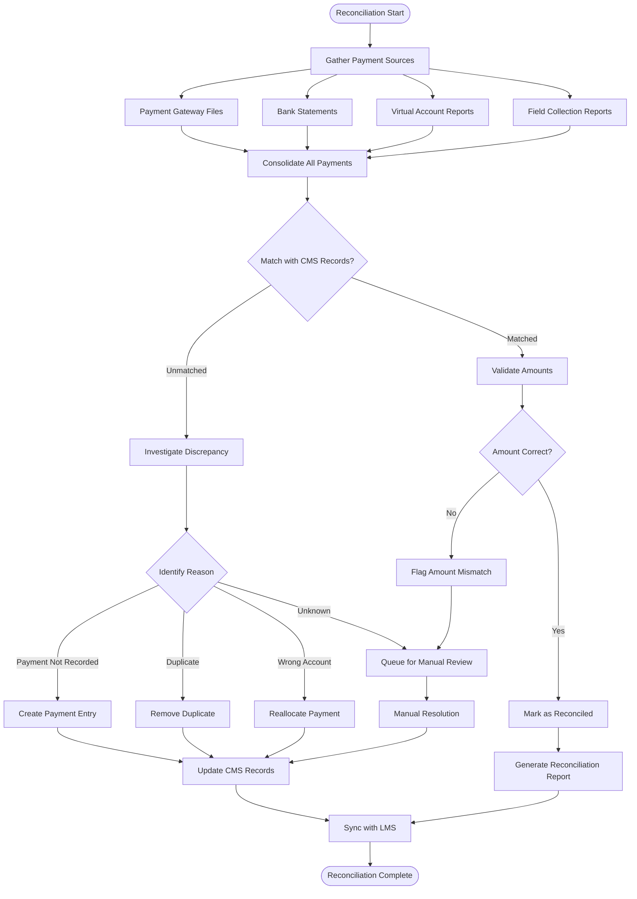

---

## 5. Field Collection Processes

### 5.1 Field Visit Planning and Execution

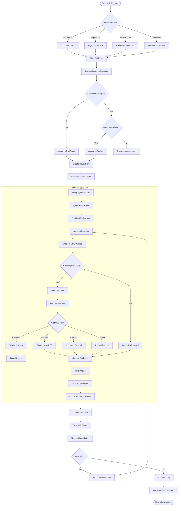

### 5.2 Mobile App Workflow for Field Agents

```mermaid
flowchart LR
    subgraph AppStart["App Initialization"]
        Login[Agent Login]
        Login --> Biometric[Biometric Auth]
        Biometric --> LoadData[Download Cases]
        LoadData --> CheckOffline{Offline Mode?}
        CheckOffline -->|Yes| LoadCache[Load Cached Data]
        CheckOffline -->|No| SyncFresh[Sync Fresh Data]
    end
    
    subgraph DayPlanning["Day Planning"]
        LoadCache --> ViewRoute[View Route Map]
        SyncFresh --> ViewRoute
        ViewRoute --> ReviewCases[Review Case Details]
        ReviewCases --> StartRoute[Start Route]
    end
    
    subgraph VisitExecution["Visit Execution"]
        StartRoute --> Navigate[Navigation to Location]
        Navigate --> Arrival[Arrival at Location]
        Arrival --> CheckInProcess[Check-in Process]
        CheckInProcess --> ExecuteVisit[Execute Visit]
        ExecuteVisit --> RecordOutcome[Record Outcome]
        RecordOutcome --> CheckOutProcess[Check-out Process]
    end
    
    subgraph DataSync["Data Management"]
        CheckOutProcess --> QueueSync{Network Available?}
        QueueSync -->|Yes| ImmediateSync[Sync Immediately]
        QueueSync -->|No| QueueData[Queue for Sync]
        QueueData --> RetrySync[Retry When Online]
        ImmediateSync --> NextVisit[Next Visit]
        RetrySync --> NextVisit
    end
```

---

## 6. Escalation and Strategy Workflows

### 6.1 Horizontal and Vertical Escalation

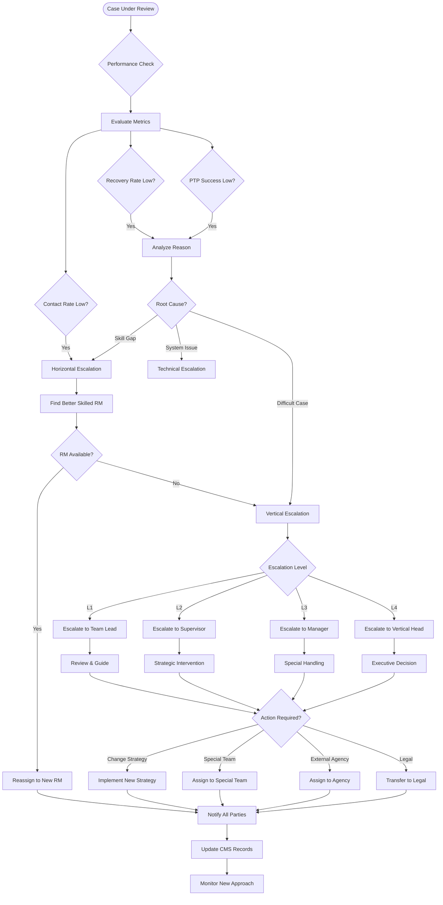

### 6.2 Dynamic Strategy Assignment

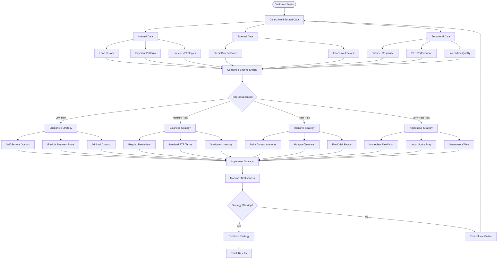

---

## 7. Reporting and Analytics Flows

### 7.1 Real-time Dashboard Update Flow

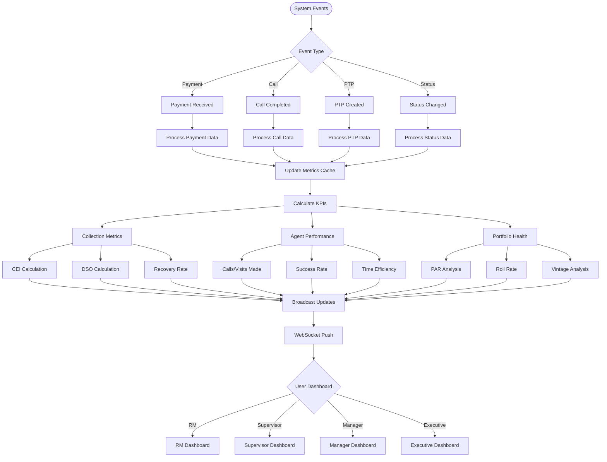

### 7.2 Report Generation Workflow

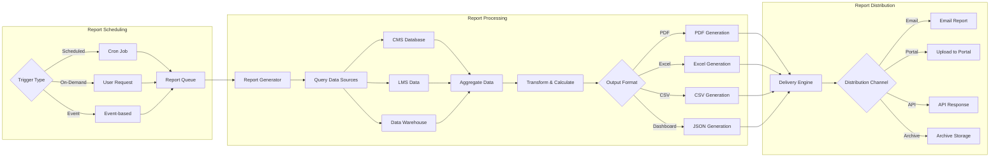

---

## 8. Integration Process Flows

### 8.1 LMS Integration Flow

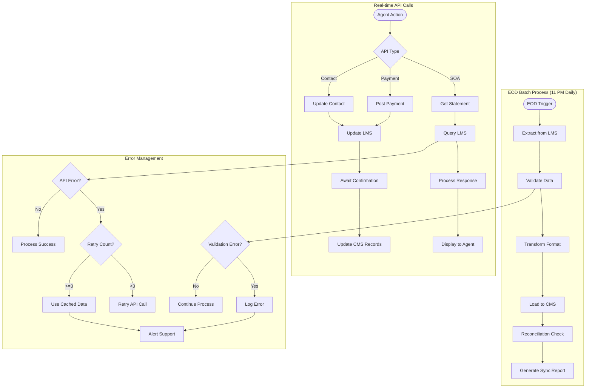

### 8.2 Payment Gateway Integration

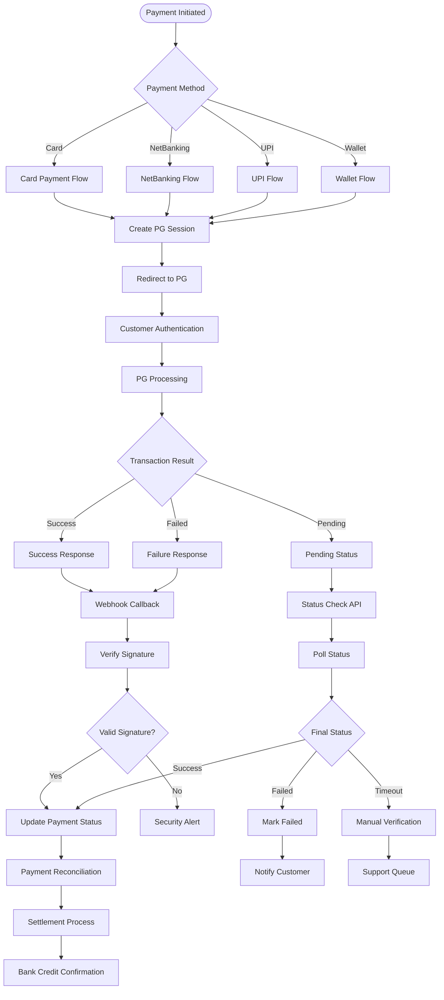

### 8.3 Communication Channel Integration

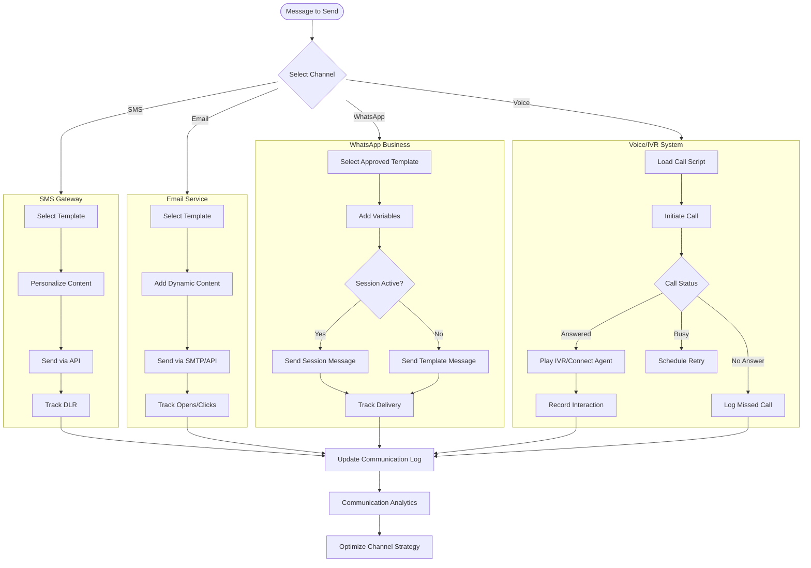

---

## Process Flow Legend

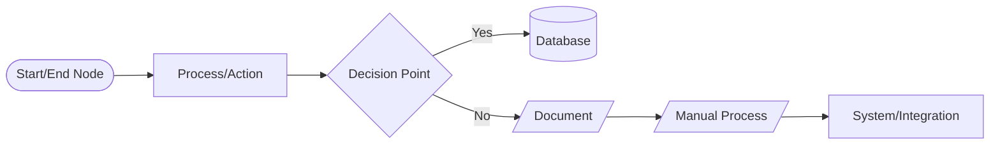

### Symbol Definitions:
- **Oval**: Start/End points
- **Rectangle**: Process or action steps
- **Diamond**: Decision points requiring branching logic
- **Cylinder**: Database operations
- **Parallelogram**: Documents or reports
- **Slanted Rectangle**: Manual interventions
- **Rectangle with double sides**: External system integration

---

## Implementation Notes

### Critical Path Processes
1. **EOD/BOD Synchronization**: Must complete within 2-hour window
2. **Real-time Payment Processing**: Maximum 30-second response time
3. **PTP Monitoring**: Automated checks every 30 minutes
4. **Field Visit Check-in**: GPS validation within 50-meter radius

### Performance Requirements
- API response time: < 2 seconds
- Batch processing: < 2 hours for 1M records
- Dashboard refresh: Real-time (< 1 second)
- Report generation: < 30 seconds for standard reports

### Error Handling Principles
1. All processes must have fallback mechanisms
2. Failed transactions must be queued for retry
3. Manual intervention queues for unresolved issues
4. Comprehensive audit logging for all operations

### Security Checkpoints
- Authentication required at all entry points
- Encryption for all data in transit
- Role-based access control for all processes
- Audit trails for all data modifications

---

*End of Process Flow Documentation*